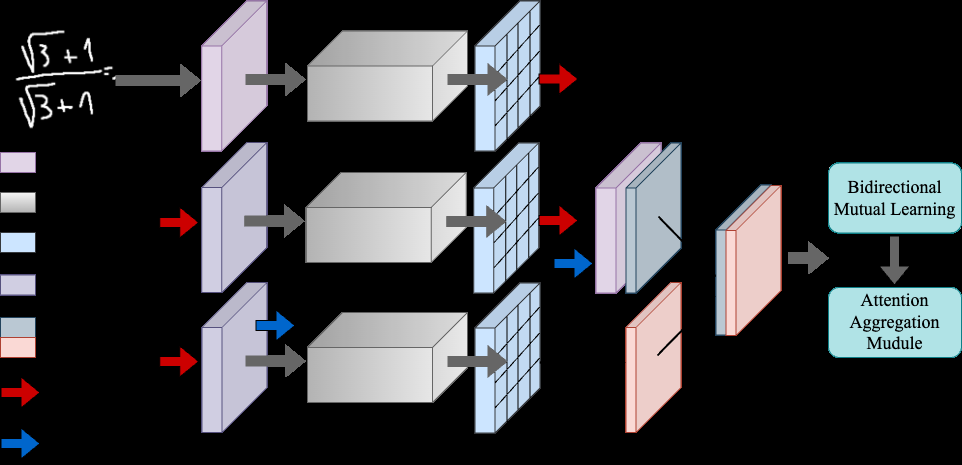
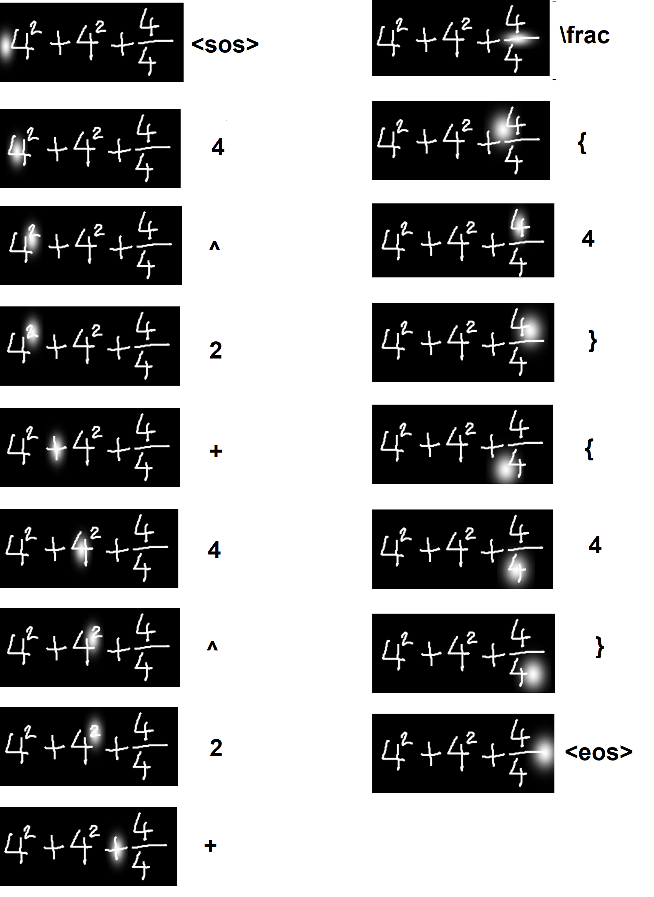

# MSFAB — Handwritten Mathematical Expression Recognition Using Multi-Scale Features and Attention-Based Model

Official implementation of *"Handwritten Mathematical Expression Recognition Using Multi-Scale Features and Attention-Based Model."*

**Muhammad Bilal Aslam**, Asad Rehman, Ahmad Salman, Syed Sarib Naveed, Muhammad Usman Safder, Muhammad Usman Ilyas, Khawar Khurshid

`[ADD PAPER LINK ONCE ON arXiv]`

---

## Overview

Handwritten mathematical expressions vary widely in writing style, orientation and clarity, and dense encoders lose fine-grained detail to pooling — precisely the detail needed to resolve superscripts, subscripts and nested structure.

This work proposes a **stacked-dense network** with two additions:

- **Feature Collection (FC)** — multi-scale feature collection that concatenates high- and low-resolution feature maps, preserving detail otherwise discarded during pooling.
- **Region-Wise Attention aggregation (RWA)** — attention aggregated region-wise rather than globally.

The model is an encoder–decoder that emits LaTeX sequences from expression images, and supports both a single left-to-right decoder and a dual L2R / R2L decoder with mutual learning.


*Proposed feature extraction encoder with bidirectional mutual learning and attention aggregation.*

---

## Results

Evaluated on **CROHME 2014, 2016, 2019** and **HME100K**. Results are from the L2R branch; baseline scores are taken from their original papers.

| Dataset | Method | ExpRate (%) | ≤1 error (%) | ≤2 error (%) |
|---|---|---|---|---|
| **CROHME 2014** | ABM | 52.84 | 72.11 | 79.01 |
| | SAN | 56.20 | 72.61 | 79.23 |
| | PosFormer | 60.45 | 77.28 | 83.68 |
| | **Ours** | **62.07** | **77.08** | **84.28** |
| **CROHME 2016** | ABM | 52.92 | 69.66 | 78.73 |
| | SAN | 53.64 | 69.61 | 76.81 |
| | PosFormer | 60.94 | 76.72 | 83.87 |
| | **Ours** | **61.38** | 76.11 | **84.39** |
| **CROHME 2019** | ABM | 53.96 | 71.06 | 78.65 |
| | SAN | 53.54 | 69.36 | 70.17 |
| | PosFormer | 62.22 | 79.40 | 86.57 |
| | **Ours** | **63.47** | 79.23 | **86.73** |
| **HME100K** | ABM | 65.93 | 81.16 | 87.86 |
| | NAMER | 68.52 | 83.10 | 89.30 |
| | PosFormer | 70.55 | 86.09 | 90.51 |
| | **Ours** | **70.88** | **86.87** | 89.91 |

At 131 symbol classes on CROHME 2014: **58.22% ExpRate, 13.43% WER** (PosFormer 57.31%).

### Ablation — CROHME 2014 test set

| Method | ExpRate (%) | ≤1 error (%) | ≤2 error (%) | WER (%) |
|---|---|---|---|---|
| Baseline (ABM) | 52.84 | 72.11 | 79.01 | 11.98 |
| + RWA | 55.24 | 72.37 | 76.32 | 11.90 |
| + FC | 58.84 | 74.56 | 81.62 | 11.72 |
| **Proposed (FC + RWA)** | **62.07** | **77.08** | **84.28** | **10.53** |

Both modules contribute independently, and combining them yields the largest gain.


*Attention visualisation for the expression `4^2 + 4^2 + \frac{4}{4}`.*


*Representative failure cases on CROHME (top) and HME100K (lower rows).*

---

## Setup

```bash
pip install -r requirements.txt
```

Download the training and test data [here](https://drive.google.com/drive/folders/1vXQnSSKvQGPCXIp99aD0sSFLnsEWXOzn?usp=sharing) and place it in `data/`.

## Training

Trained on CROHME 2014; evaluated on CROHME 2014, 2016 and 2019.

```bash
sh train.sh -L2R          # single left-to-right branch (baseline)
sh train.sh -L2R-R2L      # dual branch (proposed)
```

## Testing

```bash
sh test.sh -2014 L2R
sh test.sh -2014 R2L
```

Pretrained weights: `[ADD LINK IF AVAILABLE]`

---

## Attribution

This implementation **builds on the official ABM codebase**, from which the training loop, data pipeline and overall repository structure are derived:

> Bian, X., Qin, B., Xin, X., Li, J., Su, X., & Wang, Y. (2022). *Handwritten Mathematical Expression Recognition via Attention Aggregation based Bi-directional Mutual Learning.* AAAI 2022. — [github.com/XH-B/ABM](https://github.com/XH-B/ABM)

ABM is also the baseline this work is measured against (see the ablation table above). **Our contribution is the FC and RWA modules and the resulting architecture**; the surrounding training infrastructure is ABM's.

## Licence

**CC BY-NC-SA 4.0**, matching the upstream ABM licence in accordance with its ShareAlike condition. See [LICENSE](LICENSE).

## Citation

```bibtex
@article{aslam2025msfab,
  title   = {Handwritten Mathematical Expression Recognition Using
             Multi-Scale Features and Attention-Based Model},
  author  = {Aslam, Muhammad Bilal and Rehman, Asad and Salman, Ahmad and
             Naveed, Syed Sarib and Safder, Muhammad Usman and
             Ilyas, Muhammad Usman and Khurshid, Khawar},
  year    = {2025}
}
```
